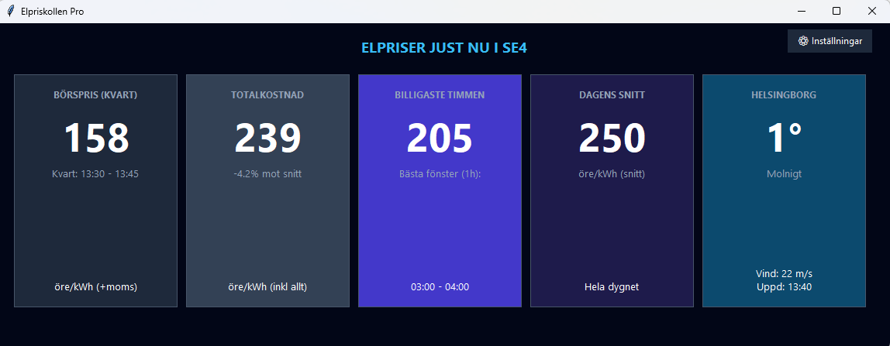

# ⚡ Elpriskollen Pro
### *Smart Real-Time Electricity Monitoring for Sweden*

<p align="center">
  
  
  
</p>

---

## 📸 Dashboard Preview


---

## 📥 Download & Install
**The easiest way to use Elpriskollen Pro is to download the standalone executable.** 1. **[Download Elpriskollen.exe](https://github.com/ran74/elpriskollen/releases/latest)** (Click "Assets" and choose the `.exe` file).
2. Run the file. Windows might show a "SmartScreen" warning—click **"More info"** and then **"Run anyway"**.
3. On first launch, follow the Setup Wizard to select your elområde (SE1-SE4) and city.

---

## 🚀 Key Features
* **Quarterly Pricing (MTU):** Real-time tracking of the new 15-minute price intervals.
* **Invoice Price:** Calculates the final cost including VAT, Energy Tax (53.5 öre), and fees.
* **Savings Wizard:** Finds the cheapest continuous **60-minute** block for high-energy tasks.
* **Dynamic Colors:** Cards turn **Green** when prices are low and **Red** when they exceed the daily average.

---

## 🛠️ Build from Source
If you prefer to run it using Python:
```bash
git clone [https://github.com/ran74/elpriskollen.git](https://github.com/ran74/elpriskollen.git)
pip install requests
python elpris_gui.py
